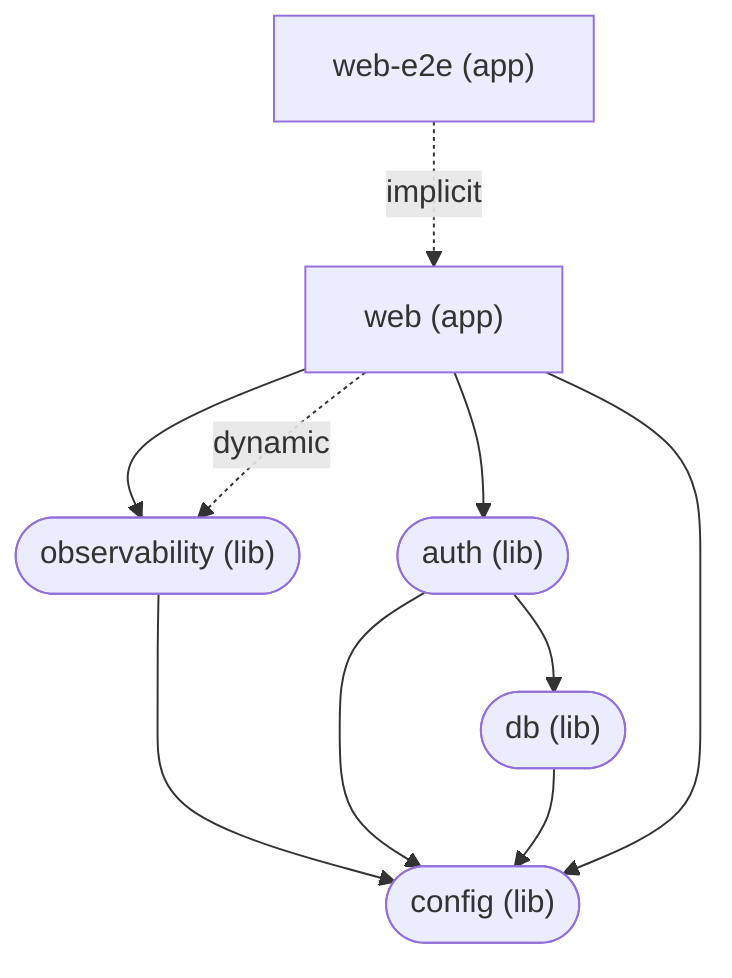

# App Architecture

Current-state view of this repo's TypeScript apps and packages — what exists, what depends on what. Structural (the graph below) generated from Nx's real project graph, not hand-drawn; only this narrative is hand-written. See [ADR-00006](adrs/00006-documentation-strategy.md) and its amendment in [ADR-00016](adrs/00016-opentelemetry-adoption-and-observability-requirements.md) (this file covers only the TypeScript side — the non-TypeScript `services/*` and the system's runtime/data-flow picture are [docs/system-architecture.md](system-architecture.md) instead, since Nx's graph has no way to represent a non-TS service).

Regenerate the graph below after adding, removing, or re-wiring a dependency between any app/package:

```
node scripts/generate-app-architecture.mjs
```

## Dependency graph

<!-- nx-graph:start -->



<!-- nx-graph:end -->

`-->` is a static (regular import-time) dependency; `-.->` is either a dynamic (`import()`-at-runtime) dependency or an implicit one Nx infers without a code import (e.g. `web-e2e`'s dependency on `web`, which is really "start `web`'s dev server and hit it over HTTP", not a code import — see ADR-00003's `enforce-module-boundaries` config for why apps never import each other directly).

## Apps

- **`web`** — the only real application right now. Next.js (App Router), sign-in/sign-up/dashboard wired to `auth`, an `/api/health` route (ADR-00018's Collector filter target), and `instrumentation.ts` calling `observability`'s `setup()` (ADR-00020).
- **`web-e2e`** — Playwright, drives `web` over HTTP. Not a code dependency of `web` (see above); Nx just knows to start `web`'s dev server first.

No `apps/admin` or `apps/mobile` yet — both are named as future consumers in ADR-00004/ADR-00012 but not scaffolded.

## Packages

- **`config`** — env-var validation (`createEnvGetter`, ADR-00013). Depended on by every package/app that reads its own env vars directly; deliberately has no dependencies of its own.
- **`db`** — Postgres/Drizzle, the single schema source of truth (ADR-00011), including the tables Better Auth's Drizzle adapter needs.
- **`auth`** — Better Auth (ADR-00012), server/client split (`./server`, `./client` — no combined barrel, so a client bundle can never accidentally pull in server-only DB access).
- **`observability`** — logging/tracing/metrics/error-reporting, on OpenTelemetry (ADR-00020). Every other app/package that needs to log or emit telemetry depends on this, not on a vendor SDK directly. Its `web -> observability (dynamic)` edge above is `apps/web/src/instrumentation.ts`'s deliberate dynamic import of the `./node` subpath (keeps Node-only SDK code out of the Edge runtime bundle); the `(static)` edge is everywhere else importing the lightweight, universal-safe facade.

No `packages/domain` or `packages/ui` yet — both are named in ADR-00004 as the eventual home for shared business logic and shared React components respectively, once more than one app needs either.
