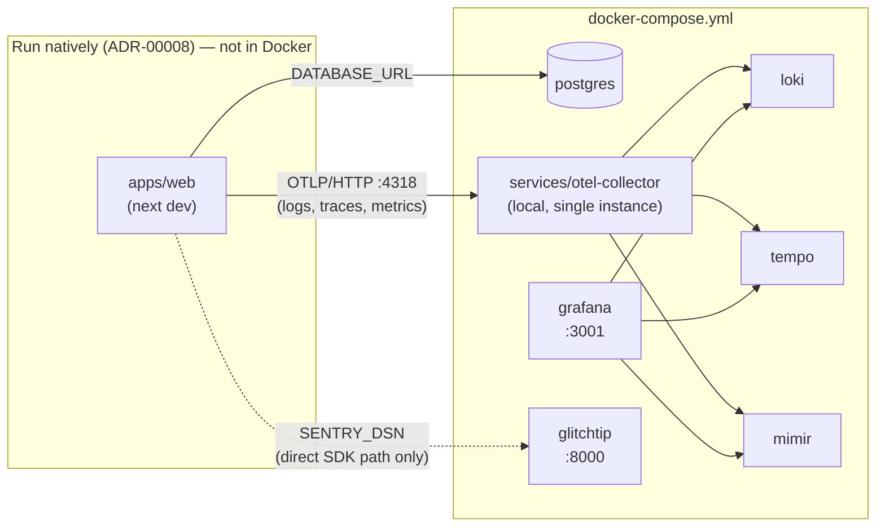

# System Architecture

Current-state view of the whole running system — not just the TypeScript apps/packages ([docs/app-architecture.md](app-architecture.md) covers those, generated from Nx's project graph), but everything that runs: backing services, the non-TypeScript `services/*` (ADR-00019, invisible to Nx's graph), and telemetry data flow end to end. Hand-drawn/hybrid, per [ADR-00006](adrs/00006-documentation-strategy.md)'s amendment in [ADR-00016](adrs/00016-opentelemetry-adoption-and-observability-requirements.md) — edited in place as the system changes, not generated.

## Local development



`apps/web` runs as a native process (`pnpm nx dev web`), not inside Docker — only backing services live in Compose (ADR-00008). `services/otel-collector`, `loki`, `tempo`, `mimir`, `grafana`, and `glitchtip` are all exceptions to "backing services are the only thing in Compose": they're genuinely services, but each runs as a single shared local instance rather than one-per-app, since there's only ever one local dev process emitting telemetry at a time (ADR-00021). Bring the whole stack up with `pnpm run otel:sync && docker compose up -d` (the sync step decides whether to pull a prebuilt Collector image or build one locally — see `services/otel-collector/README.md`). `docker/` (repo root) holds the static config mounted into Loki/Tempo/Mimir/Grafana — distinct from `services/`, which is reserved for components this repo actually builds and ships its own image for (ADR-00019/00021).

**Local error tracking is asymmetric, deliberately** (ADR-00021): GlitchTip covers `SENTRY_DSN` (the direct-SDK path, `Sentry.captureException()`) only — it doesn't implement the org-management API + OTLP ingestion the Collector's `sentryexporter` needs, so the Collector-routed Sentry path has nothing real to talk to locally (`SENTRY_URL`/`SENTRY_ORG_SLUG`/`SENTRY_AUTH_TOKEN` are placeholder values that keep the Collector startable but never resolve to anything — see the Telemetry data flow section below).

## Telemetry data flow

```mermaid
graph LR
  app["An app/service<br/>(packages/observability, ADR-00020)"]
  otel["OpenTelemetry Collector<br/>(services/otel-collector, ADR-00018/00019)"]

  app -->|OTLP| otel

  subgraph tracesPipeline["traces pipeline"]
    direction TB
    tailsampling["tail_sampling<br/>drops whole health-check traces<br/>(ADR-00022)"]
    redactT["redaction<br/>hmac-sha256, allow_all_keys"]
    tailsampling --> redactT
  end

  subgraph logsPipeline["logs pipeline"]
    direction TB
    filter["filter/health_checks<br/>drops health-check log records<br/>(ADR-00018)"]
    redactL["redaction<br/>hmac-sha256, allow_all_keys"]
    filter --> redactL
  end

  otel --> tracesPipeline
  otel --> logsPipeline

  tracesPipeline -->|traces| tempo["Tempo"]
  tracesPipeline -->|traces| sentry["Sentry<br/>(sentryexporter, by service.name)<br/>real Sentry only — see note below"]
  logsPipeline -->|logs| loki["Loki"]
  otel -->|metrics<br/>+ spanmetrics-derived RED| mimir["Mimir"]
  app -.->|"Sentry.captureException()<br/>(direct SDK path, own beforeSend redaction)"| sentryOrGlitchtip["Sentry (prod) /<br/>GlitchTip (local, ADR-00021)"]

  tempo & loki & mimir --> grafana["Grafana<br/>dashboards (\"reports\", ADR-00016)"]
```

Every app/service talks OTLP to its local (or, in production, agent-per-service — ADR-00018's Consequences; not yet hosted anywhere) Collector — never directly to Loki/Tempo/Mimir/Sentry (ADR-00016). The Collector redacts (HMAC-hashed, not deleted, so correlated values stay correlatable — ADR-00018) and drops health-check noise before anything leaves the process — traces via `tail_sampling` (whole-trace drop, ADR-00022), logs via `filterprocessor` (per-record drop, ADR-00018; the two use different mechanisms deliberately, see ADR-00022's Context for why a trace needs different handling than a log record). Sentry gets data through **two independent paths** (ADR-00017): Collector-routed traces (correlated with everything else through the same pipeline) and direct `Sentry.captureException()` calls from `packages/observability`'s own exception handler (Sentry's native error-grouping/release-tracking UX). Both redact independently — a test verifying the two redaction implementations cover the same sensitive-field patterns is a hard requirement (ADR-00018/00020), not optional, specifically because this two-path split is a real, silent drift risk.

**In local dev only**, the Collector-routed path has nowhere real to send data (GlitchTip doesn't implement what `sentryexporter` needs — ADR-00021) — only the direct-SDK path is actually exercised locally, against GlitchTip. In production (or anywhere with real Sentry credentials configured), both paths go to the same real Sentry.

## Non-TypeScript services

`services/*` (currently just `services/otel-collector`) is a separate top-level category from `apps/*`/`packages/*` (ADR-00019) — not part of Nx's project graph, built/tested/deployed independently (its own Go toolchain, its own Dockerfile, its own path-filtered CI workflow), and versioned as a Docker image (GHCR, tagged by content hash of `services/otel-collector`'s own git tree) rather than a pnpm package. `docs/app-architecture.md`'s Nx-graph diagram has no way to represent it, which is the entire reason this file exists as a separate document.

## Production

Not fully decided yet. `apps/web`'s own production hosting is a separate, not-yet-written ADR; the Collector's production deployment shape ("agent per service," ADR-00018) has nowhere to run until that exists. The Grafana stack and Sentry are assumed hosted (Grafana Cloud / sentry.io — ADR-00017's dev/prod-parity principle: same product, not a different one per environment) rather than self-hosted in production, though that specific choice isn't recorded as its own ADR yet. GlitchTip is local-dev-only (ADR-00021) — production uses real Sentry for both the direct-SDK and Collector-routed paths, closing the asymmetry that exists locally.

`tail_sampling`'s requirement that every span of a trace reach the same Collector instance (ADR-00022) is a real, currently-latent tension with "agent per service": it holds today only because there's a single app with no cross-service trace propagation. Revisit before a second service joins a shared trace.
